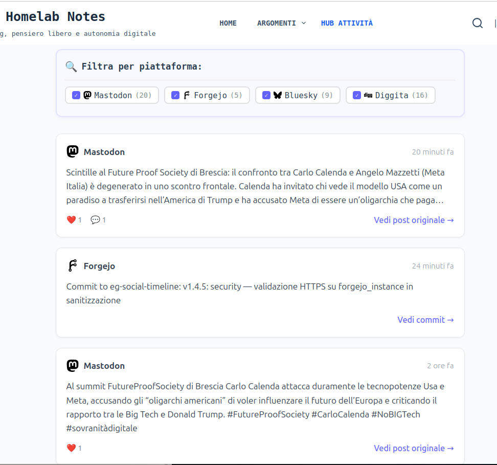
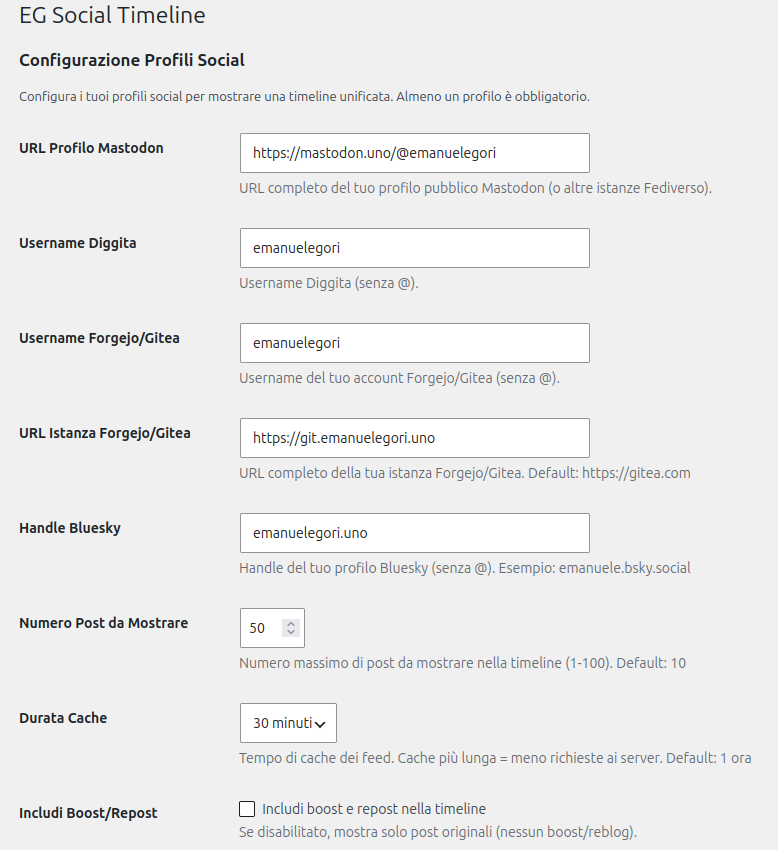
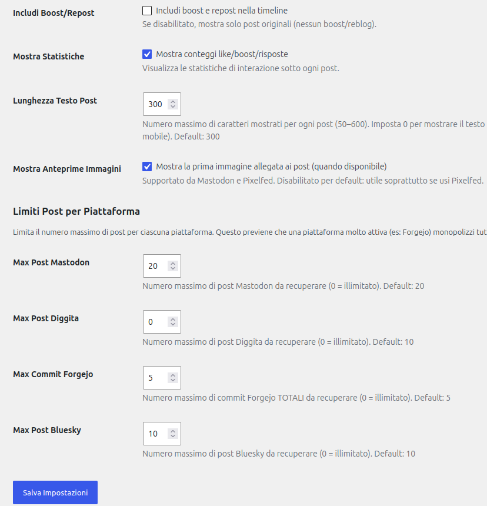

# EG Social Timeline

> 🇮🇹 Italiano · [🇬🇧 English](README.md)

[](https://git.emanuelegori.uno/emanuelegori/eg-social-timeline)
[](LICENSE.IT.md)
[](https://wordpress.org)
[](https://php.net)

Plugin WordPress per mostrare una timeline cronologica unificata delle tue attività social da **Mastodon**, **Diggita** (Lemmy), **Forgejo/Gitea** e **Bluesky**.

---

## Caratteristiche

- **Timeline Unificata**: Aggrega post da multiple piattaforme in ordine cronologico
- **Piattaforme Supportate**:
  - **Mastodon** (e compatibili ActivityPub)
  - **Diggita** (Lemmy) con statistiche complete
  - **Forgejo/Gitea** (commit repository)
  - **Bluesky** (API pubblica ATP, nessuna autenticazione)
- **Limiti Configurabili per Piattaforma**: Previene che una piattaforma monopolizzi la timeline
- **Filtri Interattivi**: Sistema filtri CSS puro per mostrare/nascondere piattaforme
- **Sistema Icone Modulare**: Icone SVG caricate da file, facilmente personalizzabili
- **Cache Intelligente**: Riduce richieste API con cache configurabile
- **Statistiche Interazioni**: Mostra like, boost e commenti per ogni post
- **Responsive**: Design ottimizzato per desktop, tablet e mobile
- **Dark Mode**: Supporto automatico tema scuro
- **Privacy-Friendly**: Solo dati pubblici, nessun tracking

---

## Screenshot



---

## Installazione

### Automatica (WordPress)

1. Scarica l'ultima versione da [Forgejo](https://git.emanuelegori.uno/emanuelegori/eg-social-timeline)
2. Vai su **Plugin → Aggiungi nuovo → Carica plugin**
3. Seleziona file ZIP scaricato
4. Clicca **Installa** e poi **Attiva**

### Manuale (FTP/SSH)

```bash
cd wp-content/plugins
git clone https://git.emanuelegori.uno/emanuelegori/eg-social-timeline.git
```

### EG Forgejo Updater (Consigliato)

Installa [EG Forgejo Updater](https://git.emanuelegori.uno/emanuelegori/eg-forgejo-updater) per aggiornamenti automatici da Forgejo.

---

## Configurazione

1. Vai su **Impostazioni → EG Social Timeline**
2. Configura almeno un profilo:
   - **Mastodon**: URL completo profilo (es: `https://mastodon.uno/@emanuelegori`)
   - **Diggita**: Username (senza @)
   - **Forgejo**: Username + URL istanza (es: `https://git.emanuelegori.uno`)
   - **Bluesky**: Handle (es: `emanuele.bsky.social`, senza @)
3. Configura limiti per piattaforma (opzionale):
   - Max post Mastodon (default: 20, 0 = illimitato)
   - Max post Diggita (default: 10, 0 = illimitato)
   - Max commit Forgejo (default: 5, 0 = illimitato)
   - Max post Bluesky (default: 10, 0 = illimitato)
4. Regola impostazioni cache e visualizzazione
5. Salva




---

## Utilizzo

### Shortcode Base

```
[eg_social_timeline]
```

### Con Limite Personalizzato

```
[eg_social_timeline limit="20"]
```

### Esempio Completo

```
<h2>La mia attività recente</h2>
[eg_social_timeline limit="50"]
```

---

## Filtri Piattaforme

Sistema filtri CSS integrato:

```
┌──────────────────────────────────────┐
│ Filtra per piattaforma:              │
│ ☑ Mastodon (12) ☑ Diggita (8)       │
│ ☑ Forgejo (5)   ☐ Bluesky (2)       │
└──────────────────────────────────────┘
```

Click checkbox = mostra/nascondi post istantaneamente (zero JavaScript richiesto!)

---

## Personalizzazione

### Icone Piattaforme

Le icone sono file SVG in `social-icons/`:

```
social-icons/
├── mastodon.svg
├── diggita.svg
├── forgejo.svg
├── bluesky.svg
└── blog.svg
```

**Per personalizzare:**
1. Sostituisci file SVG con tua icona
2. Mantieni dimensioni 24x24px e `viewBox="0 0 24 24"`
3. Usa `fill="currentColor"` per eredità colore

### CSS Personalizzato

Crea `wp-content/themes/tuo-tema/eg-social-timeline-custom.css`:

```css
/* Cambia colore primario */
.eg-timeline-filters {
    border-color: #YOUR_COLOR;
}

/* Personalizza card post */
.timeline-item {
    background: #YOUR_BG;
}
```

---

## Sviluppo

### Requisiti

- WordPress 5.0+
- PHP 7.4+
- API access alle piattaforme configurate

### Struttura File

```
eg-social-timeline/
├── eg-social-timeline.php    # Plugin principale
├── eg-social-timeline.css     # Stili
├── social-icons/              # Icone SVG
│   ├── mastodon.svg
│   ├── diggita.svg
│   ├── forgejo.svg
│   └── bluesky.svg
├── languages/                 # Traduzioni
├── README.md
├── readme.txt                 # WordPress readme
└── LICENSE
```

### API Utilizzate

- **Mastodon**: `/api/v1/accounts/{id}/statuses`
- **Diggita**: RSS `/feeds/u/{username}.xml` (con parsing statistiche)
- **Forgejo**: `/api/v1/users/{username}/repos` + `/api/v1/repos/{owner}/{repo}/commits`
- **Bluesky**: `https://public.api.bsky.app/xrpc/app.bsky.feed.getAuthorFeed` (pubblica, nessun token)

---

## Changelog

### [1.4.4] - 2026-05-24

#### Fixed
- Forgejo: ordinamento repo per `updated_at` lato client con `usort()` — il parametro `sort=recentupdate` non è supportato dall'endpoint `/users/{username}/repos`

### [1.4.3] - 2026-05-24

#### Added
- Supporto anteprime immagini con nuova opzione admin (default: disabilitato)
- Mastodon: estrazione prima immagine da `media_attachments` con `preview_url` e testo alt
- Attributo `loading="lazy"` sulle immagini

#### Fixed
- Forgejo: repo ordinati per ultimo push con `?sort=recentupdate`; interrogati solo i repo necessari (`min(repo_count, limit)`). Prima i repo più recenti venivano esclusi perché l'API restituiva i repo in ordine di creazione

#### Changed
- Struttura post unificata: campi `image_url` e `image_alt` presenti su tutte le piattaforme

### [1.4.2] - 2026-05-24

#### Added
- Traduzioni italiano (`it_IT`) e inglese (`en_US`) con file `.pot`, `.po` e `.mo`

#### Fixed
- Link "Vedi post originale" / "Vedi commit" sempre allineato a destra nel footer, anche senza statistiche

#### Changed
- Cache ID account Mastodon estesa da 24 ore a 30 giorni

### [1.4.1] - 2026-05-02

#### Added
- Lunghezza testo post configurabile da admin (default: 300, range: 50–600, 0 = testo completo senza limiti)

### [1.4.0] - 2026-05-02

#### Added
- Integrazione Bluesky via API pubblica ATP (`app.bsky.feed.getAuthorFeed`)
- Nuovo campo admin: Handle Bluesky (es. `emanuele.bsky.social`, senza @)
- Nuovo campo admin: Max Post Bluesky (default: 10, range: 0-100)
- Filtro piattaforma Bluesky nella timeline (CSS-only)
- Statistiche Bluesky: like, repost, risposte
- Supporto repost rispettando l'opzione "Includi Boost/Repost"
- Rimozione automatica `@` iniziale dall'handle in fase di sanitizzazione

#### Changed
- Validazione "almeno un profilo" estesa a Bluesky
- Messaggi di errore admin aggiornati

### [1.3.1] - 2026-04-06

#### Security
- Aggiunto `LIBXML_NONET` al parsing XML del feed RSS Diggita (anti-XXE)
- Sanitizzazione SVG inline con `wp_kses()` in `eg_social_timeline_get_icon()` (anti-XSS)
- Validazione anti-SSRF sulle URL API esterne: nuova funzione `eg_social_timeline_is_public_url()` rifiuta IP privati, riservati e localhost

#### Fixed
- Aggiunto `esc_url()` mancante su link admin nello shortcode

### [1.3.0] - 2026-01-11

#### Added
- Limiti configurabili per piattaforma nelle impostazioni admin
- Nuovi campi: Max post Mastodon, Max post Diggita, Max commit Forgejo
- Valore 0 = nessun limite (comportamento v1.2.x)
- Timeline più equilibrata: previene monopolizzazione da singola piattaforma

#### Changed
- Logica fetch modificata per rispettare limiti per piattaforma
- Forgejo: limite TOTALE commit invece di per-repo
- Default sensati: Mastodon 20, Diggita 10, Forgejo 5
- Limite totale timeline aumentato: 1-100 (era 1-50)

### [1.2.5] - 2026-01-11

#### Fixed
- Diggita statistiche: `<br>` tag convertiti in `\n` prima di `strip_tags()` per parsing corretto
- Forgejo nome repository: ora visibile in timeline ("Commit to {repo}: {message}")
- Pulsanti filtri: larghezza automatica risolve altezza disuniforme
- Icone filtri: dimensioni uniformi senza distorsione

#### Changed
- CSS: rimossa larghezza fissa pulsanti filtri (era 145px → auto)
- CSS: rimosso `object-fit: contain` da icone per rendering uniforme
- Diggita: parsing usa `str_replace` per `<br>` prima di `strip_tags()`

### [1.2.4] - 2026-01-11

#### Fixed
- Diggita: parsing HTML robusto con `strip_tags()`
- Forgejo: nome repo incluso nel content

### [1.2.3] - 2026-01-11

#### Fixed
- Filtri CSS: logica invertita
- Forgejo: link pagina commits
- UI: box filtri compatto

### [1.2.0-1.2.2] - 2026-01-11
- Integrazione Forgejo, fix vari

### [1.0.0-1.1.2] - 2026-01-10/11
- Release iniziali, API Mastodon

---

## Contributi

I contributi sono benvenuti!

1. Fork repository
2. Crea branch feature (`git checkout -b feature/AmazingFeature`)
3. Commit modifiche (`git commit -m 'Add AmazingFeature'`)
4. Push branch (`git push origin feature/AmazingFeature`)
5. Apri Pull Request

---

## Licenza

Questo progetto è rilasciato sotto licenza **GPL-2.0-or-later**.

Vedi file [LICENSE](LICENSE) per dettagli completi.

---

## Autore

**Emanuele Gori**

- Website: [emanuelegori.uno](https://emanuelegori.uno)
- Mastodon: [@emanuelegori@mastodon.uno](https://mastodon.uno/@emanuelegori)
- Gitea: [git.emanuelegori.uno](https://git.emanuelegori.uno/emanuelegori)

---

## Ringraziamenti

- Community Mastodon per API ben documentate
- Diggita.com per piattaforma Lemmy italiana
- Forgejo/Gitea per eccellente API
- WordPress community

